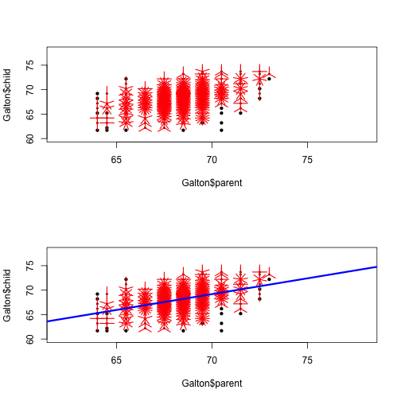

Can you predict your child's height?
========================================================
author: Chinlock
date: June 2015
transition: rotate

<seal>
Project for coursera course in "Developing Data Products"
</seal>

Worry???
=====

## Have you ever wondered what your child's height will be?  

## Is he/she going to be ....

- **Taller ?**
- *Shorter ??*
- Or the same height as you ???

Well, Galton has some data
======

Galton collected parents' and children's height. 

How do we use this to predict a child's height based on the parent's height?


```
     parent          child      
 Min.   :64.00   Min.   :61.70  
 1st Qu.:67.50   1st Qu.:66.20  
 Median :68.50   Median :68.20  
 Mean   :68.31   Mean   :68.09  
 3rd Qu.:69.50   3rd Qu.:70.20  
 Max.   :73.00   Max.   :73.70  
```

```
  parent child
1   70.5  61.7
2   68.5  61.7
3   65.5  61.7
4   64.5  61.7
5   64.0  61.7
6   67.5  62.2
```

Let's take a closer look
=======

The data points seems to be clustered around a liner relationship.  
Let's fit a linear model (blue line) to it!

 

Goto:
=====

https://chinlock.shinyapps.io/DataProductsProject

## To find out your child's height!
